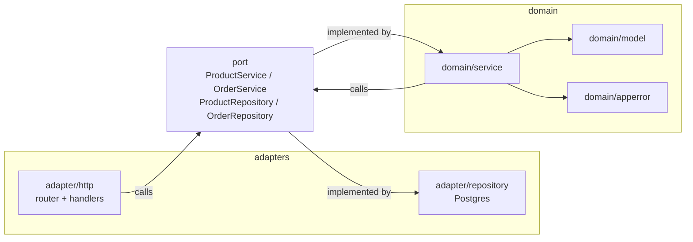
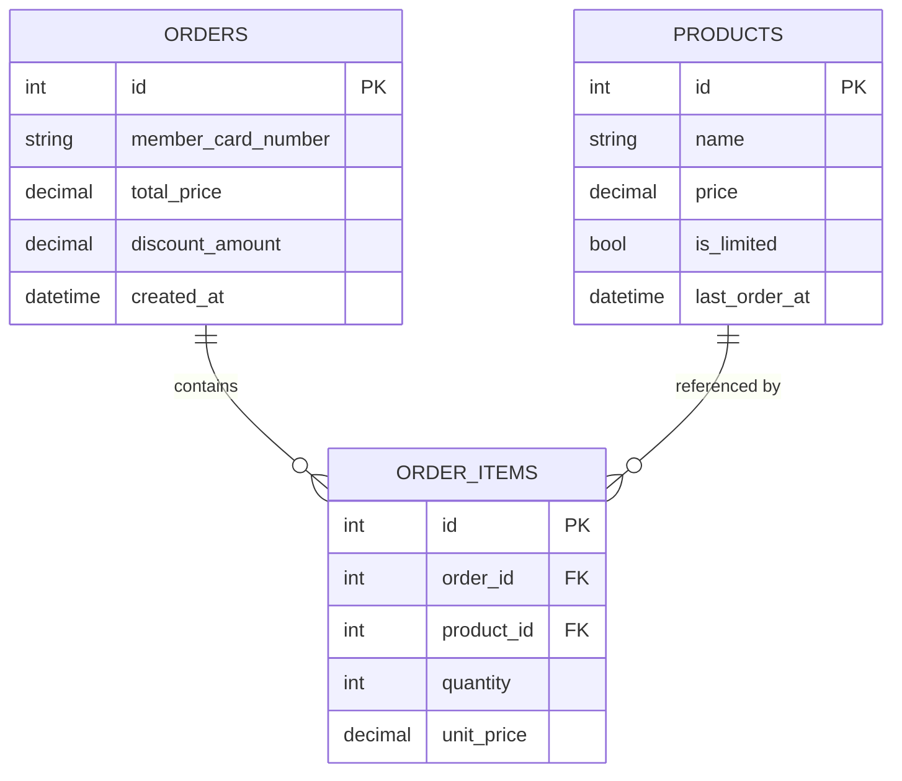

# Food Store

## Overview

Food Store is a simple point-of-sale style application for browsing products and placing orders. The project is split into two services:

- **web** — React + TypeScript frontend. Not yet initialized (no source files exist yet); this app will be scaffolded here and will consume the `api` service over HTTP.
- **api** — Go backend (module `food-store-apis`, currently only `go.mod` and an empty `cmd/api` entrypoint exist). Owns business logic and persistence, and exposes the endpoints the `web` app calls.

```
food-store/
├── web/                          # React + TypeScript frontend (not yet initialized)
└── api/                          # Go backend
    ├── go.mod
    ├── cmd/api/                  # main entrypoint — wires adapters into services
    └── internal/
        ├── domain/               # business logic, no dependency on adapters
        │   ├── apperror/         # domain error type (NotFound/Invalid/Internal)
        │   ├── model/            # plain structs: Product, Order, OrderItem
        │   └── service/          # implements the port.*Service interfaces
        ├── port/                 # interfaces shared between domain and adapters
        │   ├── product_repository.go / order_repository.go   # outbound (domain → adapter/repository)
        │   └── product_service.go / order_service.go          # inbound (adapter/http → domain/service)
        ├── adapter/
        │   ├── http/             # inbound adapter: router + handlers, depends on port.*Service
        │   └── repository/       # outbound adapter: Postgres, implements port.*Repository
        └── infra/config/         # env-based config loader
```

See [Architecture](#architecture) below for how these layers depend on each other.

## Architecture

The `api` service follows a ports-and-adapters (onion) layout. `domain` holds business logic and never imports `adapter` directly — it only knows about interfaces defined in `port`. Concrete adapters are wired into concrete services in `cmd/api/main.go`, the only place that knows about both sides.



- `port` defines the interfaces: **inbound** (`ProductService`, `OrderService`) implemented by `domain/service` and called by `adapter/http`; **outbound** (`ProductRepository`, `OrderRepository`) implemented by `adapter/repository` and called by `domain/service`.
- `domain/service` contains the business rules (e.g. order pricing is computed server-side from `ProductRepository`, never trusted from the client) and returns `domain/apperror.AppError` for expected failure cases, which `adapter/http` maps to HTTP status codes.
- `domain/model` holds plain data structs (`Product`, `Order`, `OrderItem`) shared by both `domain/service` and `adapter/repository`.

## Database Schema



- **products** — catalog of items available for purchase (`id`, `name`, `price`, `is_limited`, `last_order_at`).
- **orders** — a completed purchase (`id`, `member_card_number`, `total_price`, `discount_amount`, `created_at`).
- **order_items** — line items belonging to an order, linking an order to a product with the `quantity` and `unit_price` at time of purchase (`id`, `order_id` FK → `orders.id`, `product_id` FK → `products.id`, `quantity`, `unit_price`).

## Business Rules

### Order discounts

`domain/service.calculateDiscount` (in `order_service.go`, called from `CreateOrder`) applies two independent discount rules whenever an order is created. Both are computed against the pre-discount subtotal and summed — they do not compound:

1. **Pair discount (5%)** — for `Orange`, `Pink`, and `Green` products specifically (matched by product name), every complete pair of the *same* product ordered gets 5% off that pair's subtotal (`2 × unit_price × 5%`). A leftover odd unit is charged at full price, and quantities of the same product across multiple order lines are combined before pairing.

   ```
   Orange x2 = (120 + 120) - 5%
   Pink   x4 = (80 + 80 - 5%) + (80 + 80 - 5%)
   Green  x3 = (40 + 40 - 5%) + 40
   ```

2. **Member discount (10%)** — an additional 10% off the full order subtotal whenever `member_card_number` is provided (non-empty) on the order request. There is currently no format/existence validation of the card number — any non-empty value qualifies.

`discount_amount = pair_discount + member_discount`, and `total_price = subtotal - discount_amount`, both rounded to 2 decimal places.

### Limited products (one order per hour)

A product with `is_limited = true` (currently only `Red`) can be ordered by at most one customer per hour. `CreateOrder` checks each limited line item's `last_order_at`: if it's non-null and less than an hour old, the whole order is rejected with `apperror.ErrProductLimited` (`INVALID_INPUT`, `ErrorCode -1002`) before anything is persisted. On a successful order, every limited product involved has `last_order_at` set to the current time (via `ProductRepository.UpdateLastOrderAt`), starting its next hour-long block.

This check-then-update isn't wrapped in the same transaction as order creation, so two concurrent requests for the same limited product can both pass the check before either updates `last_order_at` -- an accepted, narrow race for this rule's current scope.
