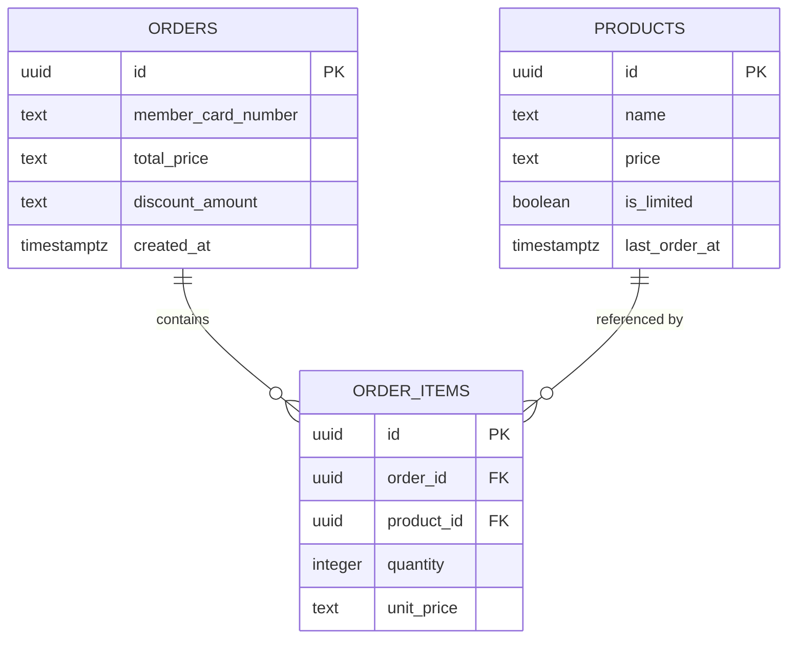

# Food Store

Food Store is a simple point-of-sale style application for browsing products and placing orders. The project is split into two services: **web** (React + TypeScript / Next.js frontend) and **api** (Go backend).

## 1. Required Tools

- Docker
- Docker Compose
- Go
- Node.js
- pnpm

## 2. After Pull Project

Create `.env` in `api/` using `api/.env.example`:

```sh
cd api
cp .env.example .env
```

Default environment variables:

```env
APP_ENV=
DATABASE_USERNAME=postgres
DATABASE_PASSWORD=postgres
DATABASE_NAME=food_store
DATABASE_HOST=localhost
DATABASE_PORT=5432
PORT=8080
```

Create `.env` in `web/` using `web/.env.example`:

```sh
cd web
cp .env.example .env
```

```env
NEXT_PUBLIC_API_BASE_URL=http://localhost:8080
```

## 3. Run Project

Start PostgreSQL (from `api/`):

```sh
cd api
docker compose up -d
```

Run the backend:

```sh
go run ./cmd/api
```

Run the frontend (from `web/`):

```sh
cd web
pnpm install
pnpm dev
```

Services:

- Frontend: `http://localhost:3000`
- Backend: `http://localhost:8080`
- PostgreSQL: `localhost:5432`

## 4. Migrate Database

Migrations live in `api/db/migrations` and are applied with [golang-migrate](https://github.com/golang-migrate/migrate). Install the CLI once:

```sh
cd api
make migrate-install
```

Then apply all migrations:

```sh
make migrate-up
```

This creates the schema and seeds the `products` table — no separate seed step is needed.

After this, you are good to go. Try the backend at `http://localhost:8080` and the frontend at `http://localhost:3000`.

## 5. Project Structure

```txt
.
|-- README.md                     # Project setup and documentation
|
|-- api/                          # Go backend (module food-store-apis)
|   |-- go.mod / go.sum           # Go module definition
|   |-- .env.example              # Sample env vars (DB connection, PORT)
|   |-- docker-compose.yml        # Local PostgreSQL service
|   |-- Makefile                  # migrate-* and sqlc-* CLI tasks
|   |
|   |-- cmd/api/                  # Entrypoint
|   |   `-- main.go               # fx DI container: wires config, DB pool, repos,
|   |                             #   services, and handlers into the HTTP server
|   |
|   |-- db/                       # Everything sqlc/golang-migrate need, kept
|   |   |                         #   outside internal/ since it's tooling input,
|   |   |                         #   not application code
|   |   |-- migrations/           # Sequential up/down SQL migrations
|   |   |                         #   (schema, uuid conversion, product seed data)
|   |   |-- query/                # Hand-written SQL (products.sql, orders.sql)
|   |   |                         #   sqlc compiles these into typed Go
|   |   `-- schema.sql            # Generated snapshot of the post-migration
|   |                             #   schema, used by sqlc — not a source of truth
|   |
|   `-- internal/                 # Application code (not importable by other modules)
|       |
|       |-- domain/               # Business logic — imports only `port`, never `adapter`
|       |   |-- apperror/         # AppError type (NotFound/Invalid/Internal) returned
|       |   |                     #   by services, mapped to HTTP status by the http adapter
|       |   |-- model/            # Plain structs: Product, Order, OrderItem
|       |   `-- service/          # ProductService/OrderService implementations —
|       |                         #   e.g. calculateDiscount lives in order_service.go
|       |
|       |-- port/                 # Interfaces bridging domain and adapters
|       |   |-- product_service.go / order_service.go
|       |   |                     #   inbound — implemented by domain/service,
|       |   |                     #   called by adapter/http
|       |   `-- product_repository.go / order_repository.go
|       |                         #   outbound — implemented by adapter/postgres,
|       |                         #   called by domain/service
|       |
|       |-- adapter/               # Concrete implementations of the port interfaces
|       |   |-- http/              # Inbound: router + handlers, depends on port.*Service
|       |   |   |-- router.go      # Registers routes under /api/v1
|       |   |   |-- handler/       # ProductHandler, OrderHandler — request/response glue
|       |   |   `-- dto/           # Request/response JSON shapes (decoupled from domain/model)
|       |   `-- postgres/          # Outbound: implements port.*Repository
|       |       |-- db.go          # sqlc's generated DBTX/Queries wiring
|       |       |-- querier.go     # sqlc-generated interface over db/query/*.sql
|       |       |-- models.go      # sqlc-generated row structs
|       |       |-- products.sql.go / orders.sql.go  # sqlc-generated query functions
|       |       `-- product_repository.go / order_repository.go
|       |                          #   hand-written adapters implementing port.*Repository
|       |                          #   on top of the generated sqlc queries
|       |
|       |-- infra/config/          # Env-based config loader (DB DSN, PORT)
|       `-- docs/                  # Serves the OpenAPI spec + Scalar reference UI
|           |-- openapi.yaml       # Hand-maintained OpenAPI spec (source for orval too)
|           `-- docs.go            # GET /docs and /docs/openapi.yaml routes
|
`-- web/                          # React + TypeScript (Next.js) frontend
    |-- package.json               # pnpm scripts: dev, build, lint, generate (orval)
    |-- orval.config.ts            # Codegen config: OpenAPI spec -> web/api/*
    |-- next.config.ts             # Rewrites /api/v1/* to NEXT_PUBLIC_API_BASE_URL
    |-- .env.example                # NEXT_PUBLIC_API_BASE_URL
    |
    |-- app/                        # Next.js App Router
    |   |-- layout.tsx              # Root layout, wraps the app in QueryProvider
    |   |-- page.tsx                # `/` — renders ProductListCell
    |   `-- calculator/page.tsx     # `/calculator` — renders OrderSummaryCell
    |
    |-- components/                 # Atomic-design UI components
    |   |-- atom/                   # Smallest reusable pieces: Button, TextInput
    |   |-- organelle/              # Medium composites built from atoms:
    |   |                           #   ProductRow (stepper card), SummaryCard
    |   `-- cell/                   # Whole page bodies: ProductListCell (home,
    |                                #   fetches products, builds the cart),
    |                                #   OrderSummaryCell (calculator, calls
    |                                #   createOrder and renders the breakdown)
    |
    |-- api/                        # Generated by orval — do not edit manually
    |   |-- models/                 # TS types from OpenAPI schemas (Product, etc.)
    |   `-- query/foodStoreAPI.ts   # Fetch functions + react-query hooks
    |                                #   (useListProducts, useCreateOrder)
    |
    |-- lib/cart.ts                 # sessionStorage helper passing the selected
    |                                #   cart (items + card number) from `/` to
    |                                #   `/calculator` between page navigations
    `-- context/QueryProvider.tsx   # Client component instantiating the
                                     #   shared react-query QueryClient
```

## 6. API Documentation

An OpenAPI spec and a Scalar-powered reference UI are served by the backend once it's running:

- API Docs: `http://localhost:8080/docs`
- OpenAPI Spec: `http://localhost:8080/docs/openapi.yaml`

## 7. Business Rules

Order pricing is always computed server-side and never trusted from the client. Two independent discounts apply to every order, computed against the pre-discount subtotal and summed (they do not compound):

1. **Pair discount (5%)** — for `Orange`, `Pink`, and `Green` products, every complete pair of the same product gets 5% off that pair's subtotal.
2. **Member discount (10%)** — an additional 10% off the full order subtotal whenever a `member_card_number` is provided.

A product with `is_limited = true` (currently only `Red`) can be ordered by at most one customer per hour: if it was last ordered less than an hour ago, the order is rejected before anything is persisted; otherwise the order proceeds and `last_order_at` is reset to now.

## 8. Database Schema


